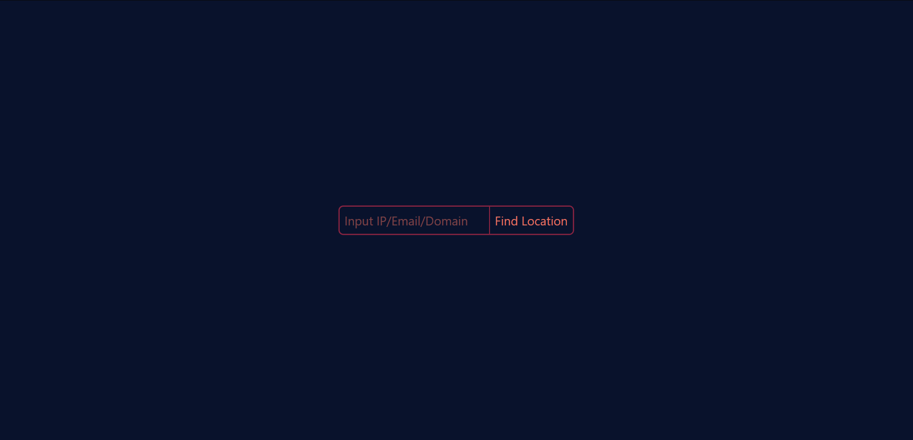
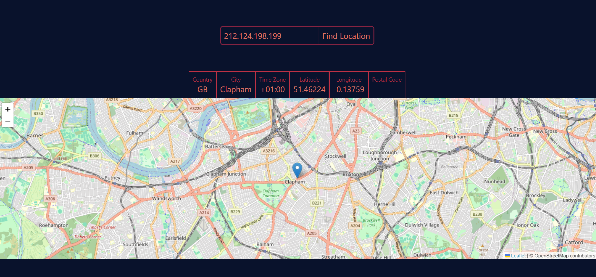

# Find by IP

This is an app that draws map using IP address, domain or email

[Live Demo](https://findbyip.aleksandrebugadze.com)

## Features
- Accepts user input (e.g. IP address, Domain or Email)
- Fetches location data from [Geo.ipify](https://geo.ipify.org)
- Draws map using [leafletjs](https://leafletjs.com)

## Stack
- React
- TypeScript
- TailwindCSS
- Java
- Spring-boot

## For Local Hosting

### Clone the repository

```bash
git clone --recursive https://github.com/LeksoBugadze/findByIp.git
```

### In back-end directory go into src/main/java/FindLOcByIpController.java and comment out line 27,30 and uncomment code under "FOR LOCAL TESTING"

### Add .env file in back-end directory that will contain

```bash
API_KEY=Your API key from Geo.ipify
BASE_URL=https://geo.ipify.org/api/v2/country,city?
```

### Run front-end

```bash
cd front-end
npm run dev
```

### Run back-end

```bash
cd back-end
mvn spring-boot:run
```

# Screenshots


